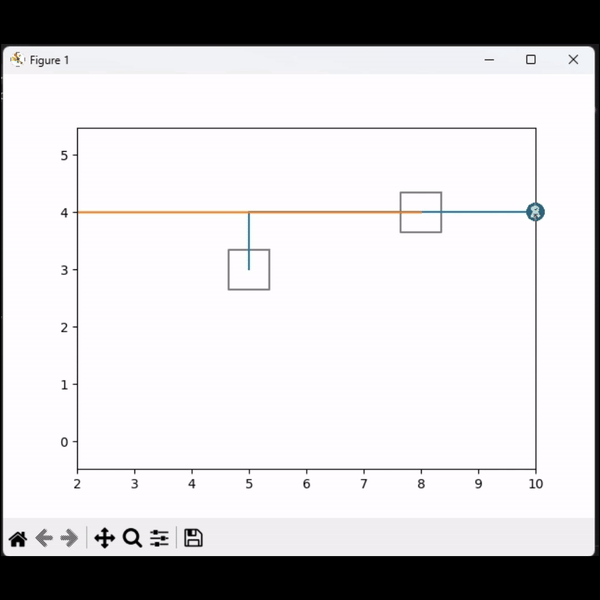
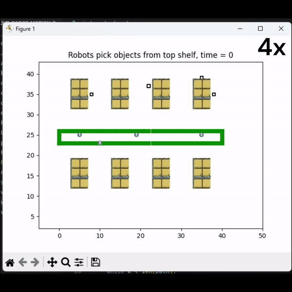
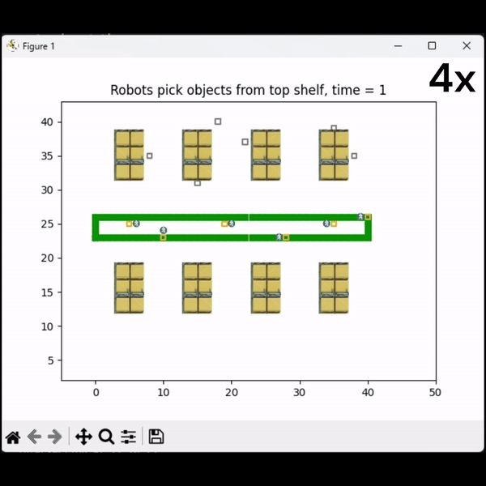

# Multi-Robot  Motion  Planning  for  Warehouse  Management

Developed a system for autonomous robot navigation in warehouses, using Cooperative A* for efficient, collision-free operation. Enhanced navigation through algorithms for real-time obstacle adjustment, improving safety and efficiency. Tested methods, particularly WHCA*, showed superior dynamic obstacle management and multi-robot coordination, promising to revolutionize warehouse logistics.

## Steps to run the code
- Install Numpy, Scipy, and Matplotlib libraries before running the code.
- Clone the repo.
- To run the 4 Robot Simulation run the `window_check.py`
  And for the 6 Robot Simulation run the `window_check2.py`
- There is a `check_intersection.py` file which can be ran to see how we avoid collision when there is head on path.
- In Code folder:
  ```
  python window_check2.py
  ```
## Report
For detailed description of the math see the report [here](Report.pdf).
## Plots and Animations
Intersection check animation:
<p float="middle">

</p>
Pick and place operation for 4 robots:
<p float="middle">

</p>
Pick and place operation for 6 robots:
<p float="middle">

</p>

Remaining plots are present in the [report](Report.pdf).

## References
1.  Abby  Jenkins,  ’What  is  warehouse  robotics?  A  2022 guide’
2. Cooperative Pathfinding using A*, David Silver, University of Alberta, Canada
3.  Cooperative  Pathfinding,  David  Silver,  University  of Alberta, Canada
4. Pritam Ojha, Atul Thakur, ’Real-Time Obstacle Avoidance Algorithm for Dynamic Environment on Probabilistic Road Map’
5. Inside Amazon’s smart warehouse
6. Motion Planning for a Chain of Mobile Robots Using A* and Potential Field
7.  Steven  M.  LaValle  -  Planning  Algorithms-Cambridge University Press (2006)
8.  Gil  Torass,  ’Multi  Stop  Route  Planning,  Universitat Salzburg, Summer 2020’
9. A Review of Motion Planning Techniques for Automated Vehicles

## Collaborators
Ankit Talele - amtalele@wpi.edu

Dushyant Patil - dpatil1@wpi.edu

Omkar Bharambe - ogbharambe@wpi.edu
  
